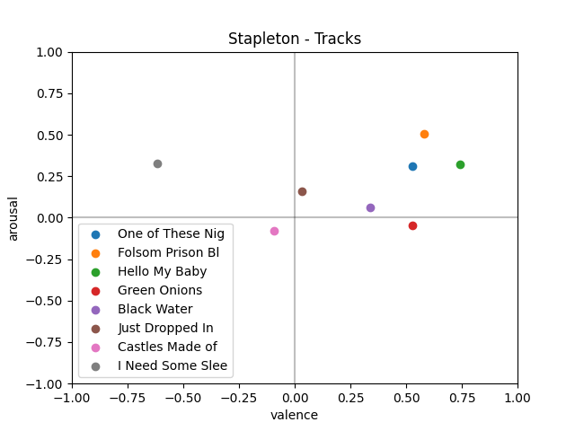
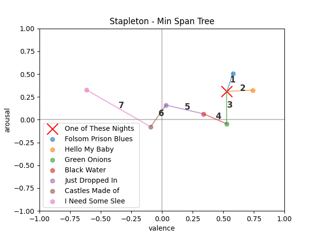
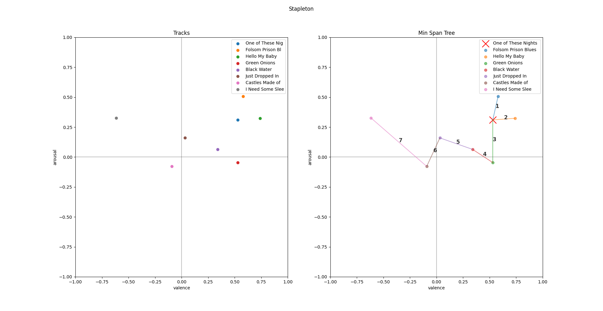

# Final Project (300 points)

## Goals

- Work in teams of 2-3 people to implement a graph algorithm
  - ~10 teams of 1-3 people each
- Work with Spotify data

## Project Roles

Distribute the following roles evenly amongst yourselves.

1. Computer Scientist (Parts A, B, D)
   - algorithms, code, github, etc.
2. Data Engineer (Parts A, C)
   - custom dataset, pre-processing, etc.
3. Communicator (Parts C, D)
   - figures, reports, deliverables, etc.

## Datasets

1. Top 5 songs from each team
   - fill out Google Form
2. Top artist from each team
   - fill out Google Form
3. Custom dataset (custom playlist of 20 - 100 songs)
   - fill out Google From

## Part A) Definitions

- Computer Scientist, Data Engineer

In the file `a_definitions.py` implement the following data structures:

- `Track`
- `Node`
- `PlaylistGraph`

## Part B) Operations

- Computer Scientist

In the file `b_operations.py` implement the following functions:

- `can_visit()`
- `set_visited()`
- `get_adjacent()`
- `get_closest_connected()`

## Part C) Figures

- Communicator, Data Engineer

In the file `c_figures.py` implement the following functions:

- `setup_plot()`
- `plot_tracks()`
- `plot_min_span_tree()`

And, reproduce the following figure for each of your datasets.

## Part D) Min Span Tree

- Computer Scientist, Communicator

`d_min_span_tree.py`

And, reproduce the following figure for each of your datasets.

## Report

- All roles

You should have three figures total for each of your datasets.

Example:

